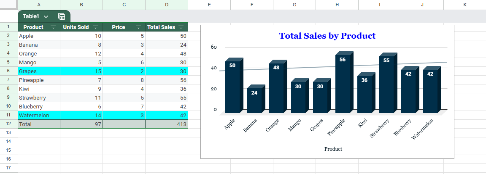

# Product Sales Dashboard

**Pitch:**  
A clean, filterable sales dashboard built in Excel to track product performance with totals and charts.

**Steps Taken:**  
1. Entered product sales data (≥10 products).  
2. Applied formulas for Total Sales and dynamic totals.  
3. Built a structured Excel Table for easy filtering.  
4. Added a simple chart (column/bar) for Product vs Total Sales.  
5. Applied conditional formatting to highlight top 2 products.  

**Result:**  
A beginner-friendly dashboard that updates automatically with filters, helping small businesses track performance without expensive software.

**Demo Script (30s):**  
“Here’s a simple Excel sales dashboard I built. Notice that when I filter by product, the totals and chart update instantly. This makes it easy for small businesses to track performance without needing expensive software.”

